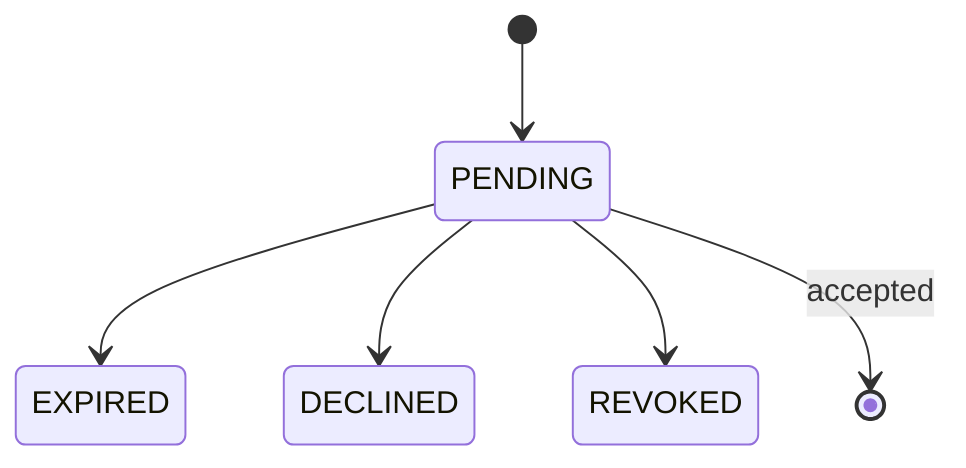
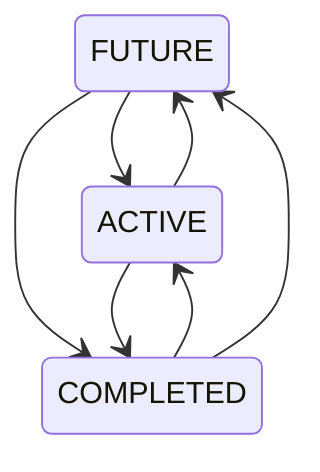

# Project Management System — Requirements Specification

**Status:** Consolidated requirements  
**Language:** English  
**Database:** MongoDB  
**Frontend:** Angular / TypeScript  
**Task description editor:** Milkdown WYSIWYG  
**Document purpose:** Product, domain, API, persistence, authorization, and business-rule specification.

---

## 1. Product Overview

The system is a multi-tenant project management application built around:

- Tenants
- Projects
- Users and memberships
- Tasks
- Task types
- Statuses
- Sprints
- Boards
- Labels
- Comments
- Task relationships
- Filters
- Audit events
- Invitations

The model intentionally avoids unnecessary entities where the behavior can be represented naturally by existing data.

### Core modeling decisions

1. A **Backlog is not a separate entity**.
2. A task with `sprintId = null` is a backlog task.
3. A task assigned to a Sprint remains part of the Project backlog conceptually; Sprint assignment is a label/reference
   used to display the task on a Sprint Board.
4. A **Sprint does not own a Board**.
5. A Board belongs to a Project.
6. A user's selected Board is a **user/project preference**, not a Sprint property.
7. Statuses and Board columns are different concepts.
8. A Board column may contain multiple statuses.
9. A separate `TaskLink` entity is not used for ordinary URLs; links are regular text/Markdown in the task description.
10. Real file attachments are not implemented initially.
11. Task types are Project-level entities.
12. Initial Task Types are `TASK`, `BUG`, and `STORY`.
13. Initial Project statuses are `TODO`, `IN_PROGRESS`, `IN_REVIEW`, `REOPENED`, and `DONE`.
14. Initial default Board columns are:
    - `TODO + REOPENED`
    - `IN_PROGRESS`
    - `IN_REVIEW`
    - `DONE`

---

# 2. Terminology

| Term                | Meaning                                                        |
| ------------------- | -------------------------------------------------------------- |
| Tenant              | Top-level organizational container                             |
| Tenant Owner        | The single owner of a Tenant                                   |
| Tenant Admin        | Tenant-level administrator                                     |
| Tenant Member       | Regular Tenant user                                            |
| Project             | Work container inside a Tenant                                 |
| Project Admin       | Project-level administrator                                    |
| Editor              | Project member who can edit permitted project data             |
| Viewer              | Read-only Project member                                       |
| Task                | Unit of work inside a Project                                  |
| Backlog             | Tasks whose `sprintId` is `null`                               |
| Sprint              | Timeboxed grouping/reference for Tasks                         |
| Board               | Project-level visual representation of Tasks                   |
| Status              | Workflow state of a Task                                       |
| Board Column        | Visual grouping of one or more Statuses                        |
| Label               | Project-level reusable Task label                              |
| Task Type           | Project-level type such as TASK, BUG, STORY                    |
| Membership          | User's access relationship to Tenant or Project                |
| Invitation          | Pending access invitation                                      |
| Historical Identity | Snapshot of a user's display name retained after user deletion |

---

# 3. Tenant Model

A Tenant is the top-level organizational boundary.

```text
Tenant
├── Tenant Memberships
└── Projects
    ├── Project Memberships
    ├── Tasks
    ├── Sprints
    ├── Boards
    ├── Statuses
    ├── Labels
    ├── Task Types
    └── other project data
```

## 3.1 Tenant statuses

```text
ACTIVE
ARCHIVED
DELETION_PENDING
```

### Archive

Archiving a Tenant automatically archives its Projects.

Projects already archived before the Tenant archive must not be accidentally restored later.

Therefore the Project stores an archive reason.

```text
archiveReason = TENANT_ARCHIVE
```

### Restore

Restoring a Tenant restores Projects that were archived because of the Tenant archive.

Projects independently archived before the Tenant archive remain archived.

### Delete

Tenant deletion uses a deletion grace period:

```text
ACTIVE
  ↓
DELETION_PENDING
  ↓
permanent deletion
```

Deletion can be cancelled during the grace period.

Permanent deletion removes the Tenant and its owned data.

If historical audit data must be retained, the Tenant should be archived instead of permanently deleted.

---

# 4. Users

A User represents a global application identity.

```js
{
  _id: ObjectId,

  email: String,
  displayName: String,
  avatarUrl: String | null,

  createdAt: Date,
  updatedAt: Date,
  deletedAt: Date | null
}
```

## 4.1 Email

Only one email field is stored.

Email is normalized before persistence.

Example:

```text
John.Doe@Example.COM
        ↓
john.doe@example.com
```

Unique index:

```text
email
```

## 4.2 User deletion

A deleted User no longer participates in live access control.

Existing business records preserve historical identity.

For example:

```js
{
  assigneeId: null,

  assigneeSnapshot: {
    displayName: "John Doe"
  }
}
```

The same principle applies to:

- Reporter
- Assignee
- Task creator
- Comment author
- Audit actor

Historical snapshots are not updated if the User later changes their name.

---

# 5. Tenant Memberships

```js
{
  _id: ObjectId,

  tenantId: ObjectId,
  userId: ObjectId,

  role: "OWNER" | "ADMIN" | "MEMBER",

  status: "ACTIVE" | "ACCESS_REVOKED",

  invitation: {
    status:
      "PENDING"
      | "EXPIRED"
      | "DECLINED"
      | "REVOKED",

    tokenHash: String,

    invitedBy: ObjectId,
    invitedOn: Date
  } | null,

  createdAt: Date,
  updatedAt: Date
}
```

Unique:

```text
tenantId + userId
```

## 5.1 Tenant roles

| Role   | Meaning                   |
| ------ | ------------------------- |
| OWNER  | Tenant owner; exactly one |
| ADMIN  | Tenant administrator      |
| MEMBER | Regular tenant member     |

Tenant Owner and Tenant Admin have the highest administrative privileges.

## 5.2 Owner

There is exactly one Tenant Owner.

Ownership transfer is an explicit administrative operation and is not an ordinary role patch.

## 5.3 Invitation lifecycle



When an invitation is accepted:

```text
invitation = null
membership.status = ACTIVE
```

Once a User has accepted an invitation, another invitation cannot be sent to the same membership unless the product
explicitly re-enters an invitation workflow.

### Re-invitation

If an invitation is sent again:

- the old invitation is replaced;
- a new token is generated;
- `invitedBy` is replaced;
- `invitedOn` is replaced;
- status becomes `PENDING`;
- the old invitation URL immediately becomes invalid;
- a new email is sent.

### Expiration

Invitation expiration is derived from:

```text
invitedOn + INVITATION_TTL
```

No persisted `expiresOn` field is required.

The backend must dynamically treat an invitation as expired even if no background job has updated its stored status.

---

# 6. Membership Expiration and Restoration

If a Membership expires and it had an invitation:

```text
membershipStatus = ACCESS_REVOKED
invitationStatus = EXPIRED
invitation = null
```

The user receives:

> Your access to `<Tenant>` has expired.

If there was no pending invitation, only:

```text
membershipStatus = ACCESS_REVOKED
```

is changed.

## Restore

A revoked membership can be restored:

```text
ACCESS_REVOKED → ACTIVE
```

and the user receives:

> Your access to `<Tenant>` has been restored.

A user who has not yet accepted an invitation cannot be restored directly to `ACTIVE`. They must explicitly accept the
invitation first.

---

# 7. Projects

```js
{
  _id: ObjectId,

  tenantId: ObjectId,

  key: String,
  name: String,
  description: String | null,

  status: "ACTIVE" | "ARCHIVED" | "DELETION_PENDING",

  defaultStatusId: ObjectId,
  defaultBoardId: ObjectId,

  archiveReason:
    "TENANT_ARCHIVE"
    | "PROJECT_ARCHIVE"
    | null,

  deletionScheduledAt: Date | null,

  createdAt: Date,
  updatedAt: Date
}
```

## 7.1 Project key

Rules:

- 2–10 characters
- starts with a letter
- uppercase letters and digits only
- examples: `PROJ`, `APP`, `WEB2`

The Project key is immutable after the first Task is created.

Project key is unique within a Tenant.

```text
tenantId + key
```

## 7.2 Project creation

Creating a Project automatically creates:

### Task Types

```text
TASK
BUG
STORY
```

### Statuses

```text
TODO
IN_PROGRESS
IN_REVIEW
REOPENED
DONE
```

The default status is:

```text
TODO
```

### Default Board

Initial columns:

```text
┌──────────────────┬─────────────┬─────────────┬──────┐
│ TODO + REOPENED  │ IN_PROGRESS │ IN_REVIEW   │ DONE │
└──────────────────┴─────────────┴─────────────┴──────┘
```

`TODO` and `REOPENED` remain separate statuses even though they occupy the same Board column.

---

# 8. Project Memberships

```js
{
  _id: ObjectId,

  projectId: ObjectId,
  userId: ObjectId,

  role: "PROJECT_ADMIN" | "EDITOR" | "VIEWER",

  createdAt: Date,
  updatedAt: Date
}
```

Unique:

```text
projectId + userId
```

## 8.1 Project roles

| Role          | Capabilities                   |
| ------------- | ------------------------------ |
| PROJECT_ADMIN | Full Project administration    |
| EDITOR        | Edit permitted Project content |
| VIEWER        | Read-only                      |

Tenant Owner and Tenant Admin retain Tenant-level administrative access without requiring a Project Membership record.

## 8.2 Removing a user from a Project

The User remains in the Tenant.

Removing Project Membership:

- removes the Project from the user's account;
- does not delete the User;
- does not delete the User's Tasks;
- does not delete the User's Comments;
- does not change historical ownership/author information.

The User can later be added back.

When re-added, their existing Tasks and Comments still belong to them, and an Editor-or-higher role can edit permitted
content again.

---

# 9. Tasks

```js
{
  _id: ObjectId,

  projectId: ObjectId,
  number: Number,

  typeId: ObjectId,

  title: String,
  description: String | null,

  statusId: ObjectId,
  priority: String,

  reporterId: ObjectId | null,
  reporterSnapshot: {
    displayName: String
  } | null,

  assigneeId: ObjectId | null,
  assigneeSnapshot: {
    displayName: String
  } | null,

  sprintId: ObjectId | null,

  labelIds: [ObjectId],

  createdById: ObjectId | null,
  createdBySnapshot: {
    displayName: String
  },

  version: Number,

  createdAt: Date,
  updatedAt: Date
}
```

## 9.1 Task number

Task numbers are sequential per Project.

```text
PROJ-1
PROJ-2
PROJ-3
```

An atomic MongoDB counter is used.

The numeric `number` itself is stored in the Task.

## 9.2 Counter

```js
{
  _id: String,
  value: Number
}
```

A counter document is atomically incremented using MongoDB `$inc`.

## 9.3 Task title

Required.

Maximum:

```text
255 characters
```

## 9.4 Task description

Optional.

Stored as Markdown.

Frontend editing uses Milkdown WYSIWYG.

```text
Milkdown
   ↓
Markdown
   ↓
API
   ↓
MongoDB String
```

No HTML/rich-text document model is required.

## 9.5 Task status

Every newly created Task receives the Project's `defaultStatusId` automatically on the UI.

The user may select another status during creation.

Example:

```text
default: TODO
user selects: IN_REVIEW
```

The API accepts the selected `statusId`.

## 9.6 Task updates

In the Task UI, fields are edited independently, Jira-style.

Examples:

```text
PATCH title
PATCH description
PATCH status
PATCH assignee
```

Each UI save changes one Task field per API call.

Other APIs may patch multiple fields in one request.

Optimistic concurrency must validate that overlapping changes do not silently overwrite one another. A three-way merge
is preferred where practical.

---

# 10. Backlog

Backlog is not an entity.

A Task is considered a backlog Task when:

```text
sprintId = null
```

When a Task is assigned to a Sprint:

```text
sprintId = <sprintId>
```

The Sprint assignment does not delete the Task from the Project's overall backlog/task universe.

A Project-level Board may therefore display all Project Tasks according to its configuration, while a Sprint Board
displays only Tasks belonging to the selected Sprint.

---

# 11. Task Types

```js
{
  _id: ObjectId,

  projectId: ObjectId,

  key: String,
  name: String,

  icon: String | null,
  position: Number,

  createdAt: Date,
  updatedAt: Date
}
```

Initial Project types:

```text
TASK
BUG
STORY
```

The key is immutable.

The display name can be changed.

Project Admin can rename or delete default and custom Task Types.

Future custom Task Types are supported by this model.

Unique:

```text
projectId + key
```

Deleting a Task Type that is in use must use the same general replacement/integrity strategy as other referenced Project
configuration entities.

---

# 12. Statuses

```js
{
  _id: ObjectId,

  projectId: ObjectId,

  name: String,
  normalizedName: String,

  position: Number,

  createdAt: Date,
  updatedAt: Date
}
```

Status names are case-insensitive.

For example:

```text
In Progress
in progress
IN PROGRESS
```

represent the same status.

Initial statuses:

```text
TODO
IN_PROGRESS
IN_REVIEW
REOPENED
DONE
```

## 12.1 Status deletion

If a Status is used by Tasks:

1. Replacement Status is mandatory.
2. All affected Tasks are updated to the replacement.
3. All Board columns referencing the deleted Status are updated to the same replacement.

If a Status is not used by Tasks but is used by Boards:

1. Warn the user which Boards reference it.
2. Offer replacement or continuation of deletion.
3. If deleted without replacement, the Board contains a reference to a nonexistent Status.
4. Such a column is not displayed on the Board.
5. On Board editing, the invalid column is displayed in red.

---

# 13. Boards

```js
{
  _id: ObjectId,

  projectId: ObjectId,

  name: String,
  type: "KANBAN" | "SPRINT",

  columns: [
    {
      id: String,
      statusIds: [ObjectId],
      position: Number
    }
  ],

  createdAt: Date,
  updatedAt: Date
}
```

A Board belongs to a Project.

A Board does not belong to a Sprint.

A column may contain multiple statuses.

Example:

```text
Column 1 → TODO, REOPENED
Column 2 → IN_PROGRESS
Column 3 → IN_REVIEW
Column 4 → DONE
```

There is no `isDefault` field on the Board; Project-level `defaultBoardId` is the source of truth.

---

# 14. Sprint Boards

A Sprint Board is a Board of type `SPRINT`.

Only one Board is displayed at a time in the UI.

When a Sprint Board is opened for a Sprint, it displays Tasks belonging to that Sprint:

```text
task.sprintId == selectedSprintId
```

The Board configuration itself remains Project-level.

Users may select an alternative Board for their own view without changing the Board used by other users.

---

# 15. User Project Board Preferences

```js
{
  _id: ObjectId,

  userId: ObjectId,
  projectId: ObjectId,

  defaultBoardId: ObjectId | null,

  createdAt: Date,
  updatedAt: Date
}
```

Unique:

```text
userId + projectId
```

Board selection is a user/project preference.

---

# 16. Sprints

```js
{
  _id: ObjectId,

  projectId: ObjectId,

  name: String,

  status: "FUTURE" | "ACTIVE" | "COMPLETED",

  startDate: Date | null,
  endDate: Date | null,

  createdAt: Date,
  updatedAt: Date
}
```

## 16.1 Sprint status transitions

Status changes are intentionally unrestricted.

Any status can transition to any other status, including:

```text
COMPLETED → ACTIVE
```

Authorization is enforced separately.



## 16.2 Future Sprint

A Future Sprint may have:

```text
no dates
```

or:

```text
startDate
endDate
```

or only:

```text
endDate
```

If dates are configured in advance, they are preserved when the Sprint starts.

If no `startDate` exists when Start is pressed:

```text
startDate = now
```

If no `endDate` exists when starting:

```text
endDate = now
```

as previously defined for the start operation.

## 16.3 Active Sprint

An Active Sprint must have a `startDate`.

Starting a Sprint automatically sets:

```text
status = ACTIVE
startDate = configured value OR now
```

`endDate` does not automatically change the Sprint status.

## 16.4 Completed Sprint

When a Sprint becomes `COMPLETED`:

```text
if endDate == null:
    endDate = now
```

If `endDate` already exists, it is preserved.

The date constraint is:

```text
endDate >= startDate
```

when both dates exist.

---

# 17. Sprint Authorization

The same users who can create Sprints can change Sprint status:

- Tenant Owner
- Tenant Admin
- Project Admin

This includes:

```text
COMPLETED → ACTIVE
```

Editors and Viewers cannot change Sprint status.

---

# 18. Labels

```js
{
  _id: ObjectId,

  projectId: ObjectId,

  name: String,
  normalizedName: String,

  createdAt: Date,
  updatedAt: Date
}
```

Labels are Project-level reusable entities.

Case-insensitive uniqueness:

```text
Bug = bug = BUG
```

If `Bug` already exists, entering `bug` in another Task selects the existing Label instead of creating another Label.

When a Label is first created from a Task, it is added to the Project's global Label list.

---

# 19. Comments

```js
{
  _id: ObjectId,

  taskId: ObjectId,

  authorId: ObjectId | null,

  authorSnapshot: {
    displayName: String
  },

  body: String,

  createdAt: Date,
  updatedAt: Date
}
```

If the author is deleted:

```text
authorId = null
authorSnapshot.displayName remains
```

The UI continues to display the historical author's name.

Viewer users cannot create, edit, or delete comments.

---

# 20. Task Relationships

Supported relationship types:

```text
BLOCKS
RELATES_TO
DUPLICATES
```

```js
{
  _id: ObjectId,

  projectId: ObjectId,

  sourceTaskId: ObjectId,
  targetTaskId: ObjectId,

  type: "BLOCKS" | "RELATES_TO" | "DUPLICATES",

  createdById: ObjectId,

  createdAt: Date
}
```

Both Tasks must belong to the same Project.

Ordinary external URLs are not represented by this entity; they are text/Markdown in the Task description.

---

# 21. Filters

Filters are user/project-specific saved configurations.

```js
{
  _id: ObjectId,

  projectId: ObjectId,
  userId: ObjectId,

  name: String,

  filters: {
    search: String | null,

    statusIds: [ObjectId],
    priority: [String],
    typeIds: [ObjectId],
    assigneeIds: [ObjectId],
    reporterIds: [ObjectId],
    sprintIds: [ObjectId | null],
    labelIds: [ObjectId]
  },

  sort: String,

  createdAt: Date,
  updatedAt: Date
}
```

Unique:

```text
userId + projectId + name
```

---

# 22. Search

Task search must support:

- Task number
- title
- description
- historical reporter name
- historical assignee name
- relevant user identity
- other supported Task fields

User-name search is case-insensitive.

Deleted users must still be discoverable through historical Task identity.

For example:

```text
search = "John Doe"
```

must find Tasks assigned to John Doe even after John's User account has been deleted.

Recommended indexed snapshot fields:

```text
reporterSnapshot.displayName
assigneeSnapshot.displayName
createdBySnapshot.displayName
```

For large-scale text search, MongoDB Atlas Search or another dedicated search mechanism may be introduced later;
ordinary indexes should cover structured filtering and sorting.

---

# 23. Pagination

The API uses conventional page/limit pagination.

Example:

```text
?page=345&limit=30&sort=createdAt:desc
```

This is intentionally URL-based so users can bookmark and restore exact table state.

Response:

```json
{
  "data": [],
  "pagination": {
    "page": 345,
    "limit": 30,
    "total": 10352,
    "totalPages": 346
  }
}
```

A reasonable maximum `limit` should be enforced, e.g. `100`.

Indexes must support common filters and sort fields.

---

# 24. Audit

Audit events preserve historical actor identity.

```js
{
  _id: ObjectId,

  tenantId: ObjectId,
  projectId: ObjectId | null,

  entityType: String,
  entityId: ObjectId,

  action: String,

  actor: {
    userId: ObjectId | null,
    displayName: String
  },

  changes: [
    {
      field: String,
      oldValue: Mixed,
      newValue: Mixed
    }
  ],

  createdAt: Date
}
```

Audit actor snapshots remain meaningful after User deletion.

Permanent Project deletion removes Project-specific audit data as part of the permanent deletion unless a separate
retention policy is introduced.

If long-term audit preservation is required, the Project should be archived rather than permanently deleted.

---

# 25. Archiving and Deletion

## Project archive

Archiving a Project makes it read-only.

Its internal entities do not need independent archive states.

```text
Project = ARCHIVED
```

Tasks, Sprints, Boards, Labels, etc. remain stored.

## Project restore

```text
ARCHIVED → ACTIVE
```

## Project deletion

Deletion uses a grace period:

```text
ACTIVE
  ↓
DELETION_PENDING
  ↓
permanent deletion
```

Deletion can be cancelled during the grace period.

Permanent deletion removes the Project aggregate:

- Tasks
- Comments
- Sprints
- Boards
- Labels
- Statuses
- Task Types
- Relationships
- Project Memberships
- Project preferences
- Project filters
- Project-specific audit records
- other Project-owned data

If users want to preserve audit/history, they should archive the Project rather than permanently delete it.

---

# 26. Task Deletion

Task deletion is a hard delete.

Deleting a Task also deletes its dependent:

- Comments
- Task relationships
- Task-label associations

No orphaned business references should remain.

An audit event for the deletion is created before the Task disappears, subject to the applicable audit retention rules.

---

# 27. Sprint Deletion

Deleting a Sprint does not delete Tasks.

All affected Tasks are updated:

```text
sprintId = null
```

The Sprint is then hard-deleted.

---

# 28. Board Deletion

Deleting a Board does not change Tasks.

Tasks do not depend on a specific Board.

---

# 29. Label Deletion

Deleting a Label removes all Task-label associations for that Label.

---

# 30. Status Deletion

Status deletion must account for both:

1. Task references
2. Board column references

If a replacement is selected, it must be applied consistently to both Tasks and Boards.

---

# 31. User Deletion

Deleting a User:

- removes the User from live membership/access control;
- removes Tenant Memberships;
- removes Project Memberships;
- does not delete Tasks;
- does not delete Comments;
- does not erase historical identity.

Existing Tasks retain:

```text
createdBySnapshot
reporterSnapshot
assigneeSnapshot
```

where applicable.

Comments retain:

```text
authorSnapshot
```

Search must continue to find these historical records.

---

# 32. Permissions

## 32.1 Role hierarchy

```text
Tenant Owner
    ↓
Tenant Admin
    ↓
Project Admin
    ↓
Editor
    ↓
Viewer
```

Tenant Owner/Admin retain Tenant-level authority even without explicit Project Membership.

## 32.2 High-level permission matrix

| Operation                         | Owner | Tenant Admin | Project Admin |                   Editor | Viewer |
| --------------------------------- | ----: | -----------: | ------------: | -----------------------: | -----: |
| Manage Tenant                     |   Yes |          Yes |            No |                       No |     No |
| Manage Project                    |   Yes |          Yes |           Yes |                       No |     No |
| Manage Project Members            |   Yes |          Yes |           Yes |                       No |     No |
| Create Sprint                     |   Yes |          Yes |           Yes |                       No |     No |
| Change Sprint Status              |   Yes |          Yes |           Yes |                       No |     No |
| Change Sprint Status to any state |   Yes |          Yes |           Yes |                       No |     No |
| Edit Project configuration        |   Yes |          Yes |           Yes |                  Limited |     No |
| Create/Edit permitted Tasks       |   Yes |          Yes |           Yes |                      Yes |     No |
| View Tasks                        |   Yes |          Yes |           Yes |                      Yes |    Yes |
| Delete Tasks                      |   Yes |          Yes |           Yes |                       No |     No |
| Manage Labels                     |   Yes |          Yes |           Yes | Limited by product rules |     No |
| Manage Statuses                   |   Yes |          Yes |           Yes |                       No |     No |
| Manage Boards                     |   Yes |          Yes |           Yes |                       No |     No |
| Comment                           |   Yes |          Yes |           Yes |                      Yes |     No |
| Read Comments                     |   Yes |          Yes |           Yes |                      Yes |    Yes |

Viewer is strictly read-only with respect to Tasks and related Task actions.

---

# 33. Sprint Rules Summary

| Rule                        | Requirement                          |
| --------------------------- | ------------------------------------ |
| Future Sprint dates         | Optional                             |
| Active Sprint startDate     | Required                             |
| Future Sprint without dates | Allowed                              |
| Start without startDate     | `startDate = now`                    |
| Start with predefined dates | Preserve predefined dates            |
| Missing endDate on Start    | Apply defined start-operation rule   |
| Completing without endDate  | `endDate = now`                      |
| endDate and startDate       | `endDate >= startDate`               |
| End date reached            | Does not automatically change status |
| Status order                | Unrestricted                         |
| COMPLETED → ACTIVE          | Allowed                              |
| Who can change status       | Owner/Admin/Project Admin            |

---

# 34. Concurrency

Tasks use optimistic concurrency.

Each Task has:

```text
version
```

A mutation should include the version observed by the client.

Example:

```json
{
  "title": "New title",
  "version": 12
}
```

The update succeeds only if the stored version is still `12`.

After update:

```text
version = 13
```

Conflicts return a concurrency error rather than silently overwriting another user's update.

For operations where multiple fields can be patched simultaneously, conflict handling should compare the changed fields.
A three-way merge is preferred where practical.

---

# 35. MongoDB Indexes

## Users

```text
unique: { email: 1 }
```

## Tenant Memberships

```text
unique: { tenantId: 1, userId: 1 }
```

## Projects

```text
unique: { tenantId: 1, key: 1 }
```

## Project Memberships

```text
unique: { projectId: 1, userId: 1 }
```

## Tasks

Recommended indexes include:

```text
{ projectId: 1, number: -1 }
{ projectId: 1, createdAt: -1 }
{ projectId: 1, updatedAt: -1 }

{ projectId: 1, statusId: 1, number: -1 }
{ projectId: 1, sprintId: 1, number: -1 }
{ projectId: 1, assigneeId: 1, number: -1 }
{ projectId: 1, reporterId: 1, number: -1 }
{ projectId: 1, priority: 1, number: -1 }
{ projectId: 1, typeId: 1, number: -1 }
```

## Task Types

```text
unique: { projectId: 1, key: 1 }
```

## Statuses

```text
unique: { projectId: 1, normalizedName: 1 }
```

## Labels

```text
unique: { projectId: 1, normalizedName: 1 }
```

## User Project Preferences

```text
unique: { userId: 1, projectId: 1 }
```

## Filters

```text
unique: { userId: 1, projectId: 1, name: 1 }
```

## Comments

```text
{ taskId: 1, createdAt: 1 }
```

## Sprints

```text
{ projectId: 1, status: 1 }
{ projectId: 1, startDate: 1 }
```

## Boards

```text
{ projectId: 1 }
```

## Audit Events

```text
{ tenantId: 1, createdAt: -1 }
{ projectId: 1, createdAt: -1 }
{ entityType: 1, entityId: 1, createdAt: -1 }
```

---

# 36. REST API Conventions

Base path:

```text
/api
```

Tenant examples:

```text
GET    /tenants
POST   /tenants
GET    /tenants/:tenantId
PATCH  /tenants/:tenantId
DELETE /tenants/:tenantId
```

Projects:

```text
GET    /tenants/:tenantId/projects
POST   /tenants/:tenantId/projects
GET    /projects/:projectId
PATCH  /projects/:projectId
DELETE /projects/:projectId
```

Tasks:

```text
GET    /projects/:projectId/tasks
POST   /projects/:projectId/tasks
GET    /tasks/:taskId
PATCH  /tasks/:taskId
DELETE /tasks/:taskId
```

Sprints:

```text
GET    /projects/:projectId/sprints
POST   /projects/:projectId/sprints
PATCH  /sprints/:sprintId
DELETE /sprints/:sprintId
```

Boards:

```text
GET    /projects/:projectId/boards
POST   /projects/:projectId/boards
PATCH  /boards/:boardId
DELETE /boards/:boardId
```

Statuses:

```text
GET    /projects/:projectId/statuses
POST   /projects/:projectId/statuses
PATCH  /statuses/:statusId
DELETE /statuses/:statusId
```

Labels:

```text
GET    /projects/:projectId/labels
POST   /projects/:projectId/labels
PATCH  /labels/:labelId
DELETE /labels/:labelId
```

Task Types:

```text
GET    /projects/:projectId/task-types
POST   /projects/:projectId/task-types
PATCH  /task-types/:taskTypeId
DELETE /task-types/:taskTypeId
```

Comments:

```text
GET    /tasks/:taskId/comments
POST   /tasks/:taskId/comments
PATCH  /comments/:commentId
DELETE /comments/:commentId
```

Relationships:

```text
GET    /tasks/:taskId/relationships
POST   /tasks/:taskId/relationships
DELETE /task-relationships/:relationshipId
```

---

# 37. API Validation

The backend must validate:

- authenticated identity;
- Tenant membership;
- Project membership;
- role;
- entity ownership/boundary;
- referenced entity belongs to the same Project where required;
- status belongs to Project;
- label belongs to Project;
- Task Type belongs to Project;
- Sprint belongs to Project;
- Board belongs to Project;
- replacement Status belongs to Project;
- dates satisfy `endDate >= startDate`;
- Task title length;
- Project key format;
- optimistic concurrency version.

Client-side validation is not sufficient.

---

# 38. API Error Model

Use structured errors.

Example:

```json
{
  "error": {
    "code": "TASK_VERSION_CONFLICT",
    "message": "The task was modified by another user.",
    "details": {
      "currentVersion": 13
    }
  }
}
```

Recommended error codes include:

```text
UNAUTHORIZED
FORBIDDEN
NOT_FOUND
VALIDATION_ERROR
CONFLICT
TASK_VERSION_CONFLICT
DUPLICATE_PROJECT_KEY
DUPLICATE_LABEL
DUPLICATE_STATUS
INVALID_STATUS_REPLACEMENT
INVALID_SPRINT_DATES
INVITATION_EXPIRED
INVITATION_REVOKED
INVITATION_ALREADY_ACCEPTED
PROJECT_ARCHIVED
TENANT_ARCHIVED
```

---

# 39. Initial Project Seed

Creating a Project must execute a logically atomic initialization operation.

Create:

## Task Types

```text
TASK
BUG
STORY
```

## Statuses

```text
TODO
IN_PROGRESS
IN_REVIEW
REOPENED
DONE
```

## Default Board

```text
Column 1: TODO, REOPENED
Column 2: IN_PROGRESS
Column 3: IN_REVIEW
Column 4: DONE
```

Then set:

```text
Project.defaultStatusId = TODO
Project.defaultBoardId = created default Board
```

Project creation must not leave a partially initialized Project visible to users.

Use a MongoDB transaction where the deployment topology supports transactions.

---

# 40. Non-Goals / Explicitly Deferred

The following are intentionally not part of the initial implementation:

## File attachments

No real file uploads or physical file storage are required initially.

Attachment size/storage limits can be added later.

## Separate TaskLink entity for URLs

Not implemented.

URLs are ordinary text/Markdown in Task descriptions.

## Separate Backlog entity

Not implemented.

Backlog semantics are:

```text
Task.sprintId = null
```

## Custom workflow engine

Not implemented initially.

Statuses are configurable Project entities, but there is no separate transition graph.

## Sprint-owned Boards

Not implemented.

Boards belong to Projects.

## Multiple simultaneously displayed Boards

Not implemented.

The UI displays one Board at a time.

## Viewer write operations

Not implemented.

Viewer is read-only.

## Automatic Sprint completion from endDate

Not implemented.

An `endDate` does not automatically transition an Active Sprint.

---

# 41. Design Principles

## Aggregate ownership

Project is the main business boundary for:

- Tasks
- Statuses
- Labels
- Task Types
- Boards
- Sprints
- Project Memberships

## Historical identity

Deleting a User must not destroy the readability of historical business records.

Use snapshots where identity needs to remain visible.

## References vs snapshots

Live references are used for access and current identity.

Snapshots are used for historical display.

Example:

```text
assigneeId
+
assigneeSnapshot.displayName
```

## No unnecessary entities

If a concept can be represented by an existing field without losing domain clarity, do not introduce another collection.

Examples:

```text
Backlog → sprintId = null
External URL → Markdown text
Sprint Board → Project Board + selected Sprint
```

## Backend is authoritative

Frontend behavior is not a security boundary.

All authorization and business rules must be enforced server-side.

---

# 42. Future Enhancements

Potential future features include:

- Custom Task Types
- Real file attachments
- Attachment storage limits
- Advanced full-text search
- More sophisticated saved filters
- Rich notification preferences
- Custom workflow transition rules
- Additional Task relationship types
- Additional Board types
- Project templates
- More advanced audit retention
- Bulk Task operations
- Additional integrations

These should be added without breaking the core Project/Task/Sprint/Board model.

---

# 43. Final Domain Summary

The central model is intentionally simple:

```text
Tenant
  │
  ├── Users through Memberships
  │
  └── Projects
        │
        ├── Tasks
        │     ├── Status
        │     ├── Task Type
        │     ├── Labels
        │     ├── Comments
        │     └── Relationships
        │
        ├── Sprints
        │
        ├── Boards
        │
        ├── Statuses
        │
        ├── Labels
        │
        └── Task Types
```

The most important semantic rule is:

```text
Backlog is not an entity.

Task.sprintId = null
    → backlog task

Task.sprintId = SprintId
    → task assigned to that Sprint
```

Sprint assignment does not make the Task cease to be a Project Task.

Boards are Project-level views, and a user's selected Board is a personal Project preference.

Statuses are independent from Board columns, allowing one column to represent multiple statuses.

The system therefore keeps the data model normalized around actual business concepts while avoiding artificial entities
that only represent UI terminology.
