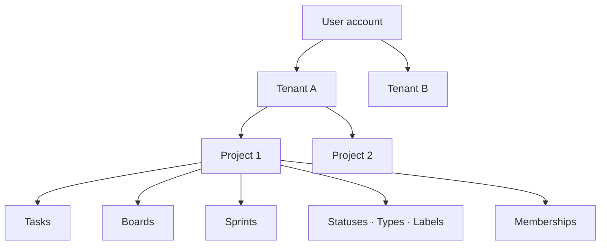

# 06 — Information Architecture

---

## 1. Product hierarchy



Rationale: the User is global; Tenants are hard isolation boundaries; Projects own all work content and configuration.
This mirrors the requirements doc §3 and matches the dominant industry hierarchy (org → project → item) documented in
[02-market-research.md](02-market-research.md) §2.

## 2. Navigation layers

### 2.1 Global navigation (always visible when authenticated)

- **Tenant switcher** (if >1 accessible Tenant) — switching clears Project context, keeps session.
- **User menu** — profile, display name, logout.
- Context breadcrumb: `Tenant → Project → Feature` so current scope is always obvious
  ([user-flows doc §7](../business_analysis/project-management-user-flows.md)).

### 2.2 Tenant-level navigation

```
Tenant Home (dashboard: projects list + CTA "Create Project")
├── Projects (list / archived list)
├── Members (tenant members, invitations, roles, access status)
├── Settings
│   ├── General
│   ├── Members & Invitations
│   ├── Plan / Billing (mock)
│   └── Danger Zone (archive / delete tenant)
```

### 2.3 Project-level navigation

```
Project
├── Overview        ← landing page: summary, active sprint, recent tasks, shortcuts
├── Board           ← selected board (user preference), optional sprint filter
├── Tasks           ← table view: search/filter/sort/paginate
├── Sprints         ← Backlog + Future | Active | Completed groups
├── Members         ← project members (admin-capable roles manage)
└── Settings
    ├── General
    ├── Members
    ├── Task Types
    ├── Statuses
    ├── Labels
    ├── Boards
    └── Danger Zone (archive / delete project)
```

Why this split:

- **Overview/Board/Tasks/Sprints** are the daily surfaces (personas Tomás/Elena/Aisha); they stay one click apart.
- **Members** is promoted to top level because invite/manage actions are frequent during team formation but rare
  afterwards.
- **Settings** groups configuration that only admins touch; hiding it from Editors/Viewers reduces noise (Viewer UX
  principle).
- Domain boundaries match [user-flows doc §6](../business_analysis/project-management-user-flows.md) exactly; visual
  arrangement may vary.

### 2.4 Task-level navigation

Task detail is a **page with stable URL** (`/tasks/:taskId`), not only a modal, because deep linking and shared URLs are
product goals (G5). From a Board card click, open the task page (or a sheet that upgrades to full page on "expand" —
implementation choice recorded in [decision-log.md](decision-log.md)).

## 3. URL scheme

Human-readable, slug-based (DEC-032, adopted in the UI/UX audit [29 §UQ-03](29-ui-ux-audit.md)):

```
/auth/login · /auth/register · /auth/reset-password
/onboarding/create-tenant          (first-tenant: name + slug + mock checkout steps)
/t/:tenantSlug                     (tenant home)         e.g. /t/my-workspace
/t/:tenantSlug/members
/t/:tenantSlug/settings/*
/t/:tenantSlug/projects/:projectKey            (overview)
/t/:tenantSlug/projects/:projectKey/board      (?boardId=&sprintId=)
/t/:tenantSlug/projects/:projectKey/tasks       (?page=&limit=&sort=&status=&type=&assignee=…)
/t/:tenantSlug/projects/:projectKey/sprints     (?sprintId= selected sprint)
/t/:tenantSlug/projects/:projectKey/members
/t/:tenantSlug/projects/:projectKey/settings/*
/t/:tenantSlug/projects/:projectKey/tasks/:taskNumber   e.g. …/tasks/ABC-123   (canonical task URL)
/invite/:token                      (invitation acceptance landing)
/profile/preferences                (theme / zoom / language / display name)
```

Rules:

- **Tenant slug**: auto-generated from the workspace name during creation (`My Workspace` → `my-workspace`), editable by
  the user before submit, globally unique (server-side availability check), lowercase `[a-z0-9-]`, max length cap so
  URLs stay short. Uniqueness is enforced by a unique index; the availability check endpoint must be enumeration-safe.
- **Project key** segment stays human-readable (`ABC`); **task URL uses the task number** (`ABC-123`) — fully
  human-readable deep links. Internal resolution: slug → tenantId, key → projectId, number → taskId.
- Task URLs are canonical via project key + task number; board/tasks URLs carry view state in query params.
- Direct navigation performs: authenticate → load context → authorize → load resource → render or correct error state
  ([user-flows doc §41](../business_analysis/project-management-user-flows.md)).
- Invalid page after deletions snaps to nearest valid page instead of an error table.
- Slug/key changes are out of scope for MVP (see OQ-005 for project keys; tenant slug mutability deferred — recommend
  immutable in MVP to avoid link rot).

## 4. State ownership summary

| State                           | Owner                                          |
| ------------------------------- | ---------------------------------------------- |
| Selected board per project      | Server (user/project preference)               |
| Selected sprint on sprint board | URL query param                                |
| Table page/limit/sort/filters   | URL query params (+ saved filters server-side) |
| Draft edits in task editor      | Client only until save                         |
| Auth/session                    | Server (JWT), client stores token              |

## 5. Why this IA

1. **Three scopes, three navigations** prevents the permission/context leakage complaints documented in market research
   (P3): settings never leak across Projects.
2. **Board and Tasks as sibling views of the same data** follows GitHub Projects' validated model — boards are views
   over Tasks, never separate stores.
3. **Stable deep-linkable URLs** enable the share-a-view workflow PMs rely on (persona Aisha).
4. **Danger zones isolated** at both levels keep destructive actions discoverable-by-admins-only.
