# 07 — User Flows

Flows use Mermaid where they clarify branching. Alternate/error paths are explicit. Companion to
[08-screen-and-page-specification.md](08-screen-and-page-specification.md).

---

## 1. Registration

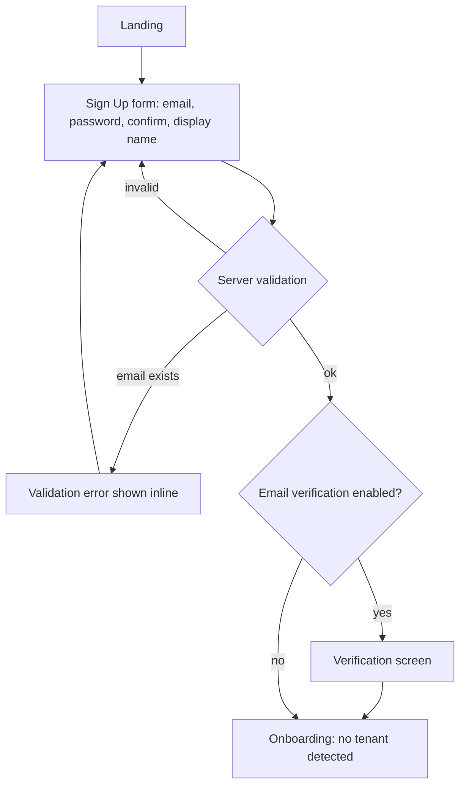

## 2. Login

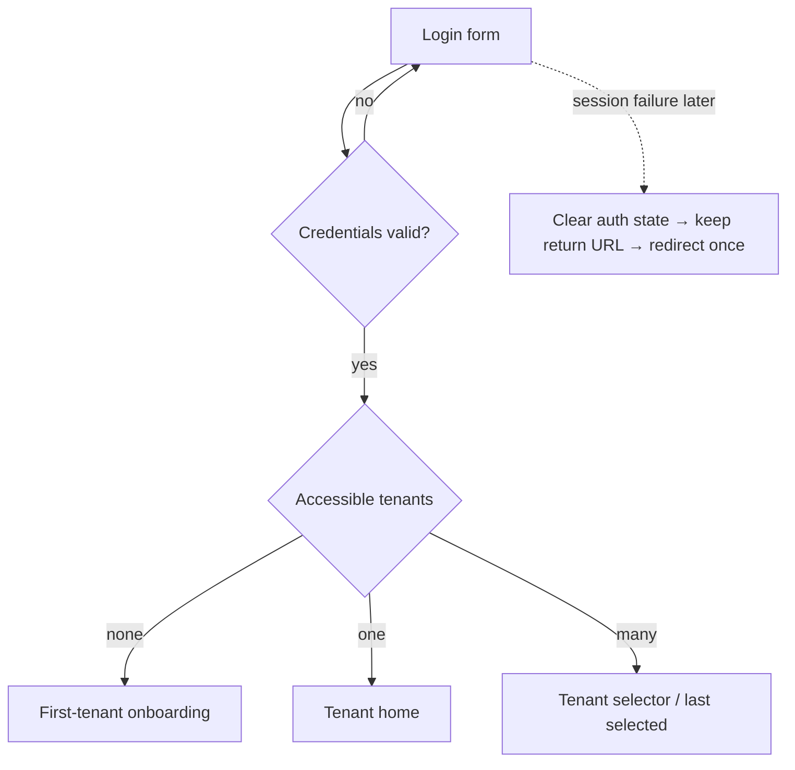

## 3. First Tenant creation

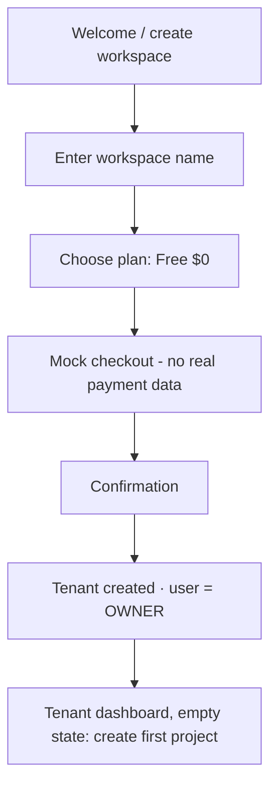

Error path: checkout step cannot fail permanently (mock); a retry affordance is still provided.

## 4. Mock checkout

Covered in flow 3 (steps C–E). Constraint: billing boundary isolated; replacing mock with a real provider must not touch
domain code ([user-flows §3.1](../business_analysis/project-management-user-flows.md)).

## 5. First Project creation

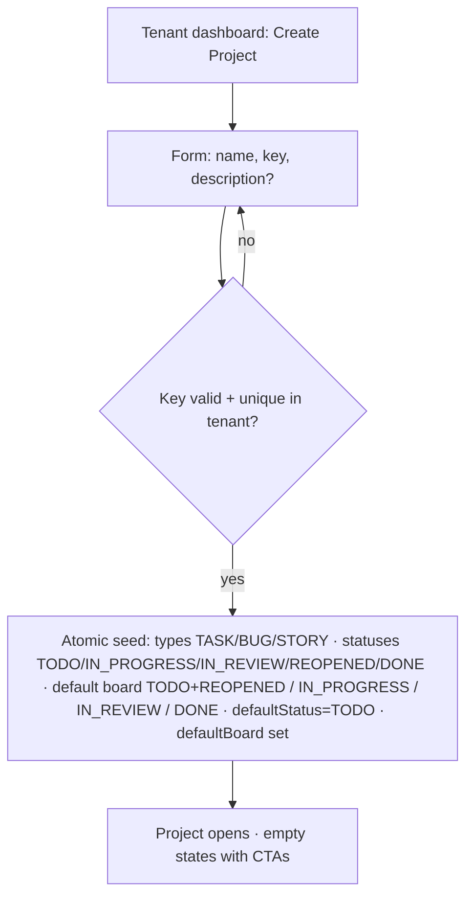

Failure path: if seeding fails, the Project is rolled back/not surfaced (no partially initialized Projects).

## 6. First Task creation

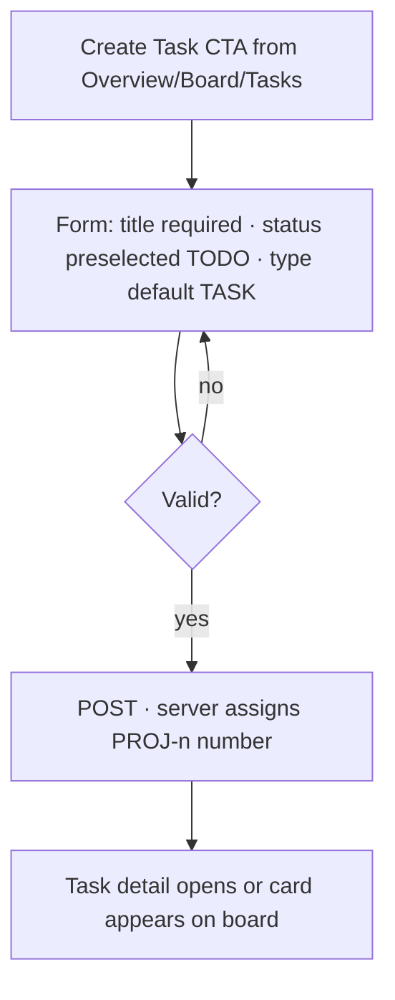

## 7. Task editing

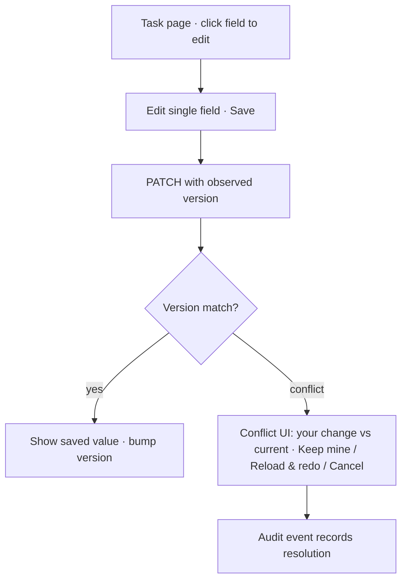

Never silently overwrite ([user-flows §11](../business_analysis/project-management-user-flows.md)).

## 8. Task commenting

Add comment (Editor+) → renders Markdown with author display name. Edit/delete per permission rules. If author deleted
later, snapshot name persists.

## 9. Label creation/reuse

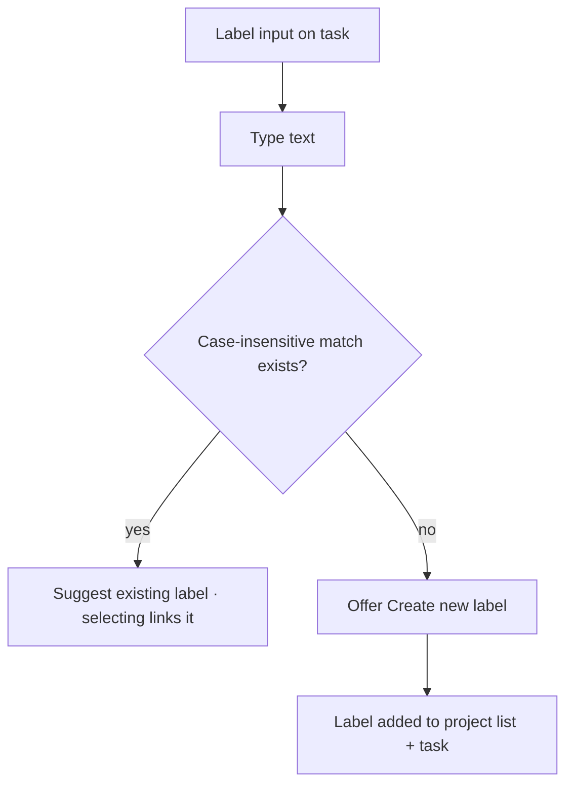

## 10. Board usage

Open Board → loads user's preferred board for the project (fallback: project default board) → columns render
(multi-status columns grouped) → drag card:

- destination column has 1 status → apply directly;
- multiple statuses → prompt status choice;
- optimistic move, rollback + toast on failure. Invalid column references (deleted status) are not rendered on view;
  visible red in board editor.

## 11. Sprint creation

PAdmin+ opens Sprints → "Create Sprint" → name (+ optional dates) → created as FUTURE. Validation: if both dates
present, `endDate >= startDate`.

## 12. Sprint start

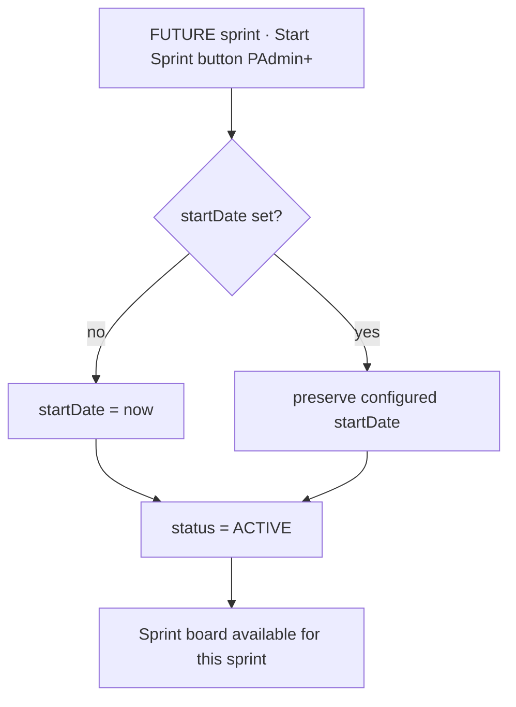

## 13. Sprint completion

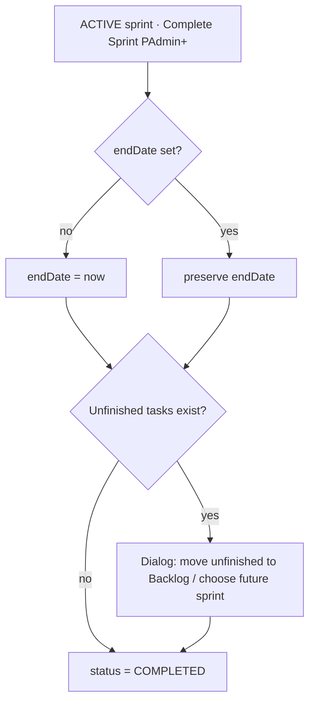

Note: passing `endDate` alone never triggers this flow (manual only — final decision).

## 14. Invitation

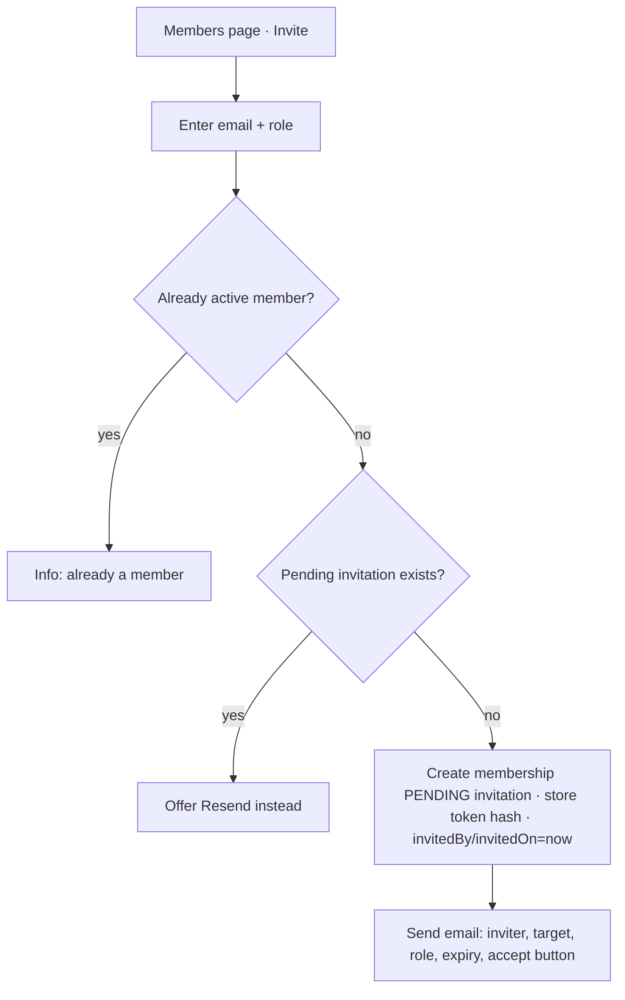

## 15. Invitation acceptance

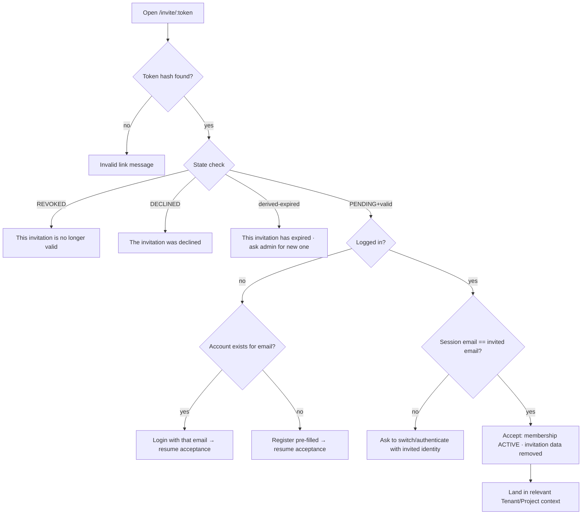

Security rule: never silently attach access to the wrong account.

## 16. Invitation resend

Resend replaces token (old link dead), updates invitedBy/invitedOn, sets PENDING, sends new email. Only possible while
not yet accepted.

## 17. Access revocation

Admin revokes ACTIVE membership → status ACCESS_REVOKED. If an invitation was pending: invitation becomes EXPIRED and
cleared. User next visiting sees "Your access to \<Tenant\> has expired."

## 18. Access restoration

ACCESS_REVOKED → ACTIVE by admin → user sees "Your access … has been restored." Exception: a user who never accepted
their invitation cannot be restored directly — they must accept explicitly.

## 19. Project member removal / re-addition

Remove → Project membership gone; Tenant membership, Tasks, Comments, snapshots untouched. Re-add → history reattaches
automatically (it was never detached); role granted determines edit rights again.

## 20. User deletion

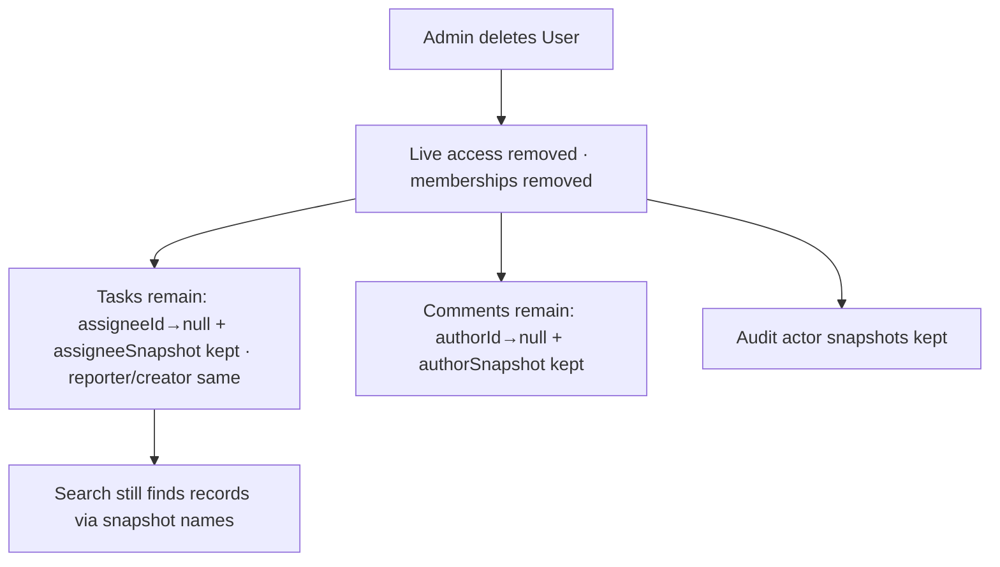

## 21. Status deletion

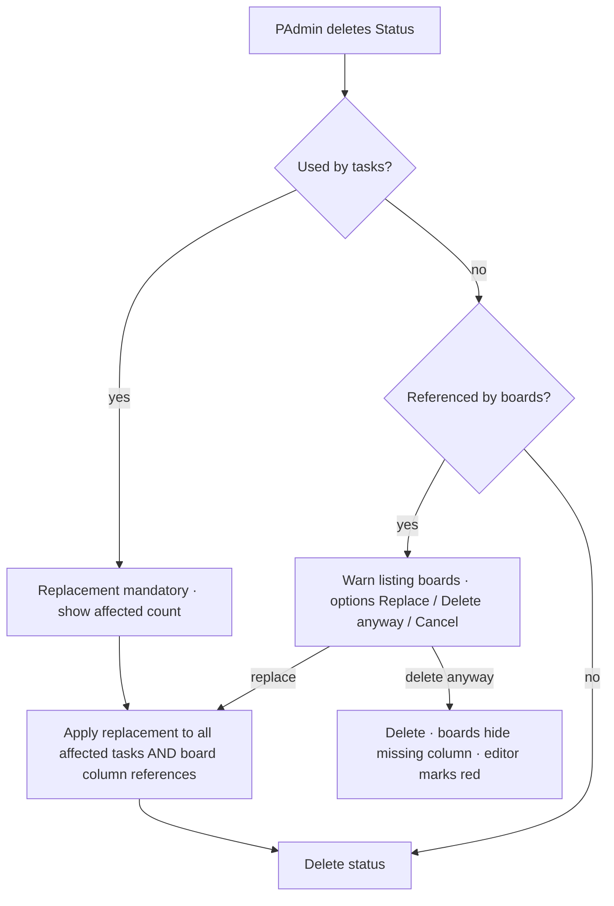

Guard: the last remaining status cannot be deleted (default status needs a target); deleting the default status requires
choosing a new default replacement.

## 22. Project archive

Settings → Danger Zone → Archive → confirm → ARCHIVED (read-only). Restore returns to ACTIVE (unless archived via Tenant
archive — then restore happens through Tenant restore).

## 23. Project deletion

Danger Zone → Delete → warning enumerating everything destroyed → type key/name to confirm → DELETION_PENDING + grace
period → cancellable → permanent aggregate deletion. Direct URLs afterwards resolve to Not Found without leaking
existence.
