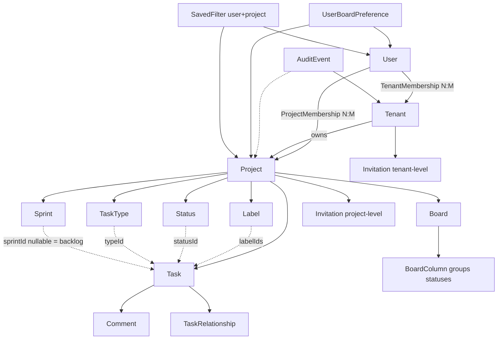

# 09 — Domain Model

Conceptual model only — MongoDB schema design happens later. Terminology is normative for all other documents; see
[26-product-glossary.md](26-product-glossary.md).

---

## 1. Entity relationship overview

## 2. Entities

### User — _entity (global identity)_

Identity for authentication. Email (normalized, unique), displayName, avatarUrl, soft-delete (`deletedAt`). Exists
independently of any Tenant.

### Tenant — _entity (isolation boundary)_

Top-level organizational container. Status lifecycle ACTIVE → ARCHIVED / DELETION_PENDING (grace period). Exactly one
Owner.

### Tenant Membership — _relationship + configuration_

`(tenantId, userId)` unique. Role OWNER|ADMIN|MEMBER; status ACTIVE|ACCESS_REVOKED; optional embedded invitation
sub-document (PENDING/EXPIRED/DECLINED/REVOKED, tokenHash, invitedBy, invitedOn). This is both an access relationship
and carries invitation state.

### Project — _entity (aggregate root for work)_

Belongs to one Tenant. Key (unique per tenant, immutable after first Task), name, description, status
ACTIVE|ARCHIVED|DELETION_PENDING, archiveReason (TENANT_ARCHIVE|PROJECT_ARCHIVE|null), defaultStatusId, defaultBoardId,
deletionScheduledAt.

### Project Membership — _relationship + configuration_

`(projectId, userId)` unique. Role PROJECT_ADMIN|EDITOR|VIEWER. No status field in the requirements schema — removal
deletes the record; revocation semantics live at Tenant level (see
[16-invitation-and-membership-flows.md](16-invitation-and-membership-flows.md) for the reconciliation).

### Task — _entity (central work item)_

Belongs to one Project. Sequential per-project `number` (atomic counter). typeId, title (≤255), description (Markdown,
nullable), statusId, priority, sprintId (nullable ⇒ Backlog), labelIds[], reporter/assignee/creator as **live
reference + display-name snapshot**, `version` for optimistic concurrency.

### Task Type — _configuration_

Project-scoped. Immutable key (TASK/BUG/STORY initially), editable name, position.

### Status — _configuration_

Project-scoped. name + normalizedName (case-insensitive uniqueness), position. Default status referenced by
Project.defaultStatusId.

### Board — _configuration (view definition)_

Project-scoped. type KANBAN|SPRINT, ordered columns; each column = {id, statusIds[], position}. A Board never belongs to
a Sprint and stores no tasks.

### Board Column — _value object inside Board_

Not an independent entity. Its identity is positional within its Board; it groups ≥1 Status references.

### Sprint — _entity (timeboxed grouping reference)_

Project-scoped. status FUTURE|ACTIVE|COMPLETED with unrestricted transitions; startDate/endDate optional with
completion-time population rules ([14-sprint-analysis.md](14-sprint-analysis.md)).

### Label — _configuration_

Project-scoped, case-insensitive unique via normalizedName.

### Comment — _entity_

taskId, authorId (nullable after author deletion) + authorSnapshot.displayName, body (Markdown), timestamps.

### Task Relationship — _relationship entity_

sourceTaskId, targetTaskId (same Project), type BLOCKS|RELATES_TO|DUPLICATES, createdById.

### Invitation — _state embedded in membership_ (not a standalone collection per requirements §5)

PENDING → EXPIRED (derived from invitedOn + TTL) | DECLINED | REVOKED | accepted (cleared). Token stored as hash only.

### Audit Event — _event record (append-only)_

tenantId, projectId?, entityType/entityId, action, actor {userId|null, displayName snapshot}, changes [{field, oldValue,
newValue}], createdAt.

### Saved Filter — _user configuration_

(userId, projectId, name) unique; filter payload + sort.

### User Board Preference — _user configuration_

(userId, projectId) unique → selected boardId.

## 3. Concept-type classification

| Concept                                                                                                    | Kind                                     |
| ---------------------------------------------------------------------------------------------------------- | ---------------------------------------- |
| User, Tenant, Project, Task, Sprint, Comment, Board, Label, Status, TaskType, TaskRelationship, AuditEvent | Entity                                   |
| Board Column                                                                                               | Value object (inside Board)              |
| reporterSnapshot / assigneeSnapshot / createdBySnapshot / authorSnapshot / actor.displayName               | Snapshot (immutable historical identity) |
| Statuses, Types, Labels, Boards, Saved Filters, Preferences                                                | Configuration                            |
| Memberships, Invitations, Relationships                                                                    | Relationships                            |

## 4. Key modeling decisions (inherited)

1. **Backlog is not an entity** — `Task.sprintId = null`.
2. **Status ≠ Board Column** — columns group statuses.
3. **Sprint does not own a Board** — boards are Project views; sprint scoping is a query filter.
4. **References vs snapshots** — live ids drive access/current identity; snapshots drive historical display and search.
5. **No unnecessary entities** — no TaskLink for URLs, no Backlog collection, no standalone Invitation collection.
6. **Aggregate ownership** — permanent Project deletion removes everything Project-owned; archive preserves all of it
   read-only.
