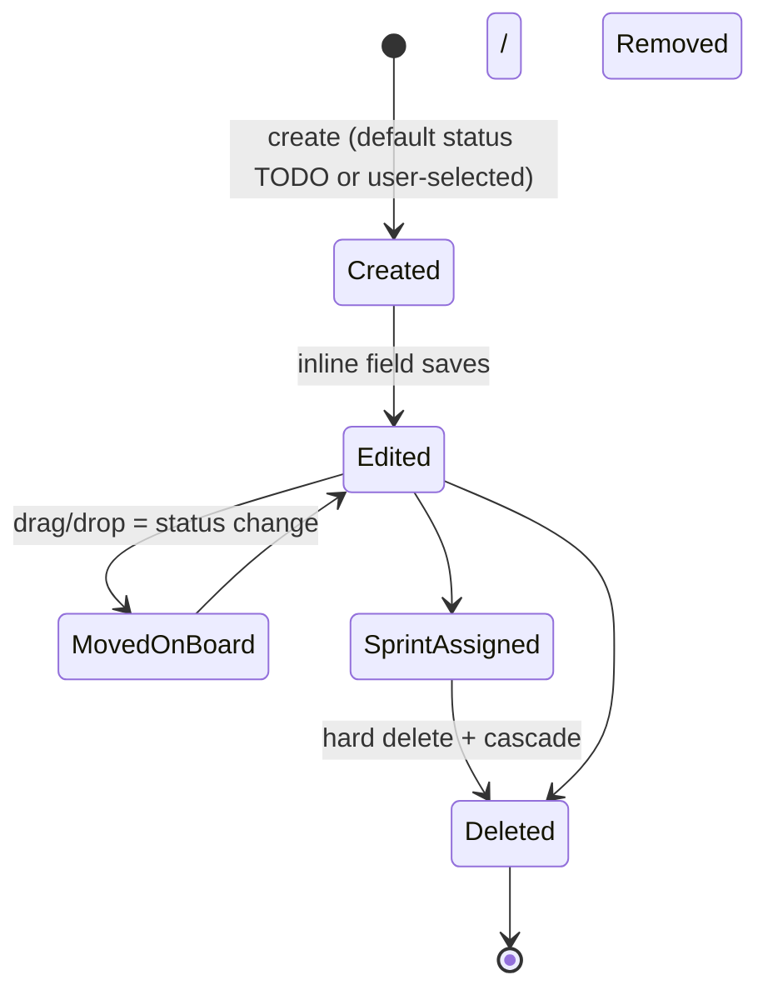

# 12 — Task Workflow

Deep analysis of the Task lifecycle: creation → editing → collaboration → deletion, plus the conceptual distinctions the
UI must communicate.

---

## 1. Lifecycle overview

There is no separate "closed" terminal state — DONE is an ordinary Status; Tasks never leave the Project except by
deletion.

## 2. Creation

- Required: title only (BR-008). Everything else optional with sensible defaults.
- Status preselected to Project default TODO; another status selectable at creation (BR-007) — deliberately allows "I'm
  logging something already in review".
- Type defaults to TASK; assignee limited to current Project members (eligible = any active project member).
- Server assigns sequential number via atomic counter (BR-006); client displays `KEY-n` after response.
- Entry points: Overview CTA, Board "+ card", Tasks table button, quick-create (future).
- Audit event `task.created` with initial snapshot of key fields.

## 3. Editing model — independent field saves

Jira-style per-field editing ([REQ §9.6], [UF §11]):

| Field       | Control                                    | Save semantics                       |
| ----------- | ------------------------------------------ | ------------------------------------ |
| Title       | click-to-edit text                         | PATCH title + version                |
| Description | Milkdown WYSIWYG ⇄ markdown toggle         | PATCH description + version          |
| Status      | select / board drag                        | PATCH statusId + version             |
| Priority    | select                                     | PATCH priority + version             |
| Assignee    | member autocomplete (clearable)            | PATCH assigneeId (+snapshot refresh) |
| Sprint      | sprint picker incl. "Backlog"              | PATCH sprintId                       |
| Labels      | tag autocomplete w/ case-insensitive reuse | PATCH labelIds                       |
| Type        | select                                     | PATCH typeId                         |

Rationale from research: Linear's speed advantage comes precisely from removing save ceremony; but unlike Linear's
occasionally-silent sync ([HN criticism](https://news.ycombinator.com/item?id=48437609)), every save is explicit and
conflict-checked.

## 4. Assignment

- Assignee must be an active Project member (or Tenant Owner/Admin acting tenant-wide). Removing a member does not
  unassign historical tasks — assignment persists as id+snapshot until someone reassigns.
- On User deletion: `assigneeId → null`, snapshot retained (BR-014).

## 5. Labels

Autocomplete/tag selector; case-insensitive match selects existing (BR-019); no-match offers creation (Editor+);
deleting a label detaches everywhere (BR-020).

## 6. Comments

Markdown bodies; author display name always rendered (snapshot-safe, BR-014/US-CMT-03). Viewer cannot write (BR-040).
Comment edit/delete per matrix (own for Editor; moderate for PAdmin+).

## 7. Relationships

BLOCKS / RELATES_TO / DUPLICATES within one Project (BR-013). Picker searches tasks by key/title. External URLs stay
plain Markdown links in the description — never relationship records ([DEC]).

## 8. Concurrency

- Every mutation carries observed `version`; mismatch ⇒ `TASK_VERSION_CONFLICT` with `currentVersion` (BR-010).
- **UI resolution contract (MVP, DEC-030):** conflict dialog explains what happened and offers **Reload (take theirs)**
  or **Cancel**; the client never silently overwrites either side. "Keep mine" (re-PATCH on a fresh version) is deferred
  — revisit if conflict frequency justifies it.
- **Three-way merge recommendation:** server compares incoming changed fields against its stored version's diff base;
  non-overlapping field changes in a multi-field patch may merge automatically; overlapping fields raise the conflict.
  This matches GitLab's practice of optimistic locking specifically where data loss hurts (title/description) and the
  requirements' preference ([REQ §34]).
- Board drags are single-field patches; conflicts roll back the optimistic move with a toast.

## 9. Sprint assignment & board movement interplay

- Moving a Task across board columns changes **Status only** — never Sprint (BR-021/022).
- Changing Sprint is done via task field or sprint planning views — never implied by board position.
- Multi-status destination column prompts for intended status; backend stores Status only.

## 10. Deletion

Hard delete (BR-012): confirm dialog enumerates cascade (comments, relationships, label links); audit event written
_before_ removal; list/board/pagination adjust afterwards.

## 11. History

Per-task activity feed renders audit events: verb + actor snapshot + field diffs (`oldValue → newValue`) + timestamp.
Status changes, assignment changes, label changes, sprint changes all appear. See
[19-audit-and-history.md](19-audit-and-history.md).

## 12. Conceptual distinctions (must be reflected in UI copy)

| Concept          | What it is                                                           | What it is NOT                                             |
| ---------------- | -------------------------------------------------------------------- | ---------------------------------------------------------- |
| **Task Status**  | The actual workflow state stored on the Task                         | Not tied to any particular board                           |
| **Board Column** | A visual grouping on one Board, possibly containing several statuses | Not a status; moving columns ≠ changing column definitions |
| **Sprint**       | A timeboxed grouping reference (`sprintId`)                          | Not a status, not a board, not a container that owns tasks |
| **Task Type**    | Classification (TASK/BUG/STORY) affecting icon/semantics             | Not a workflow state; types don't gate statuses initially  |

Common confusion (seen in competitor UX research): users conflate column movement with sprint membership. Mitigation:
when a Task is dragged on a _sprint-scoped_ board, nothing about sprintId changes — the UI should keep the sprint badge
visible on cards to reinforce this.
