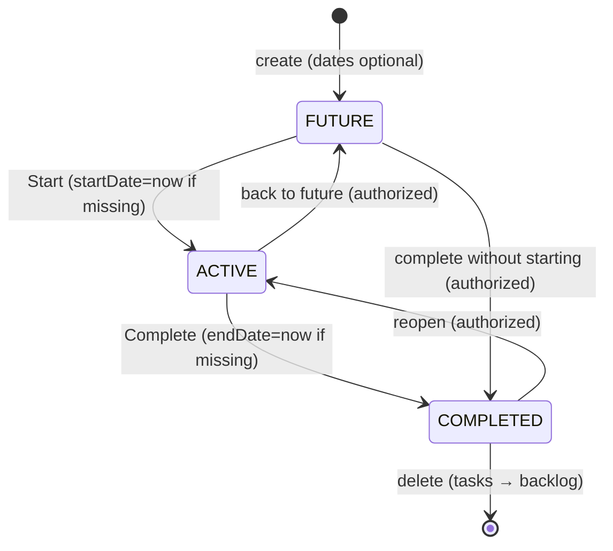

# 14 — Sprint Analysis

Research on Scrum/sprint conventions and how our deliberately lighter model relates to them.

---

## 1. How incumbents handle sprints (observed facts)

- **Jira**: Sprints are strict containers. Only one active sprint per board (parallel sprints opt-in). Completing a
  sprint **requires deciding where unfinished issues go**: Backlog, an existing future sprint, or a newly created sprint
  ([Atlassian: Complete a sprint](https://support.atlassian.com/jira-software-cloud/docs/complete-a-sprint/)). Old Jira
  versions blocked reopening closed sprints; Cloud allows viewing via reports.
- **Linear**: "Cycles" — lightweight timeboxes with auto-created cadence and a configurable incomplete-issue policy
  (auto-roll forward or keep for retrospective visibility). Teams may skip cycles entirely
  ([resumelens analysis](https://www.resumelens.org/blog/linear/linear-cycles-vs-scrum-sprints)).
- **Asana/Trello/Monday**: no native sprints — evidence that sprints are optional for many teams.
- **Scrum orthodoxy** ([Scrum.org](https://www.scrum.org/resources/blog/dont-leave-old-sprints-open)): leaving old
  sprints open destroys transparency; unfinished work should return to the backlog and the sprint should close cleanly.

## 2. Our model vs conventions

| Question                       | Industry convention                                                   | Our decision                                                    | Notes                                                                                                               |
| ------------------------------ | --------------------------------------------------------------------- | --------------------------------------------------------------- | ------------------------------------------------------------------------------------------------------------------- |
| Must dates exist?              | Usually yes                                                           | No — FUTURE sprints may be dateless                             | More forgiving; supports planning-ahead without fake dates                                                          |
| One active sprint?             | Jira enforces per board; Linear allows overlap                        | Not enforced (unrestricted transitions)                         | UI still surfaces "the active sprint" prominently; multiple ACTIVE sprints are permitted but visible as such        |
| Auto-complete at endDate?      | Linear auto-closes cycles; Scrum tools generally require manual close | **NO — manual only (final)**                                    | Consistent with "explicit over inferred" principle; avoids surprise state changes; matches Jira's manual completion |
| Reopen completed?              | Modern Jira allows; classic didn't                                    | Allowed (COMPLETED → ACTIVE)                                    | Recovery-friendly                                                                                                   |
| Unfinished tasks at completion | Explicit disposition dialog (Jira), auto-roll policy (Linear)         | Prompt: Backlog or chosen future sprint (BR-031 recommendation) | Prevents "hidden WIP in completed sprints" anti-pattern                                                             |

## 3. Lifecycle

Transitions are unrestricted by design (BR-028); authorization gates them (BR-029).

## 4. Date rules recap

- `endDate >= startDate` whenever both exist (validated client + server).
- Start: fill missing startDate with now; preserve configured dates.
- Complete: fill missing endDate with now; preserve existing.
- Passing endDate triggers nothing automatic (BR-027); the Sprints page may _visually flag_ overdue active sprints
  ("ended 3 days ago") without changing state — recommended affordance so staleness is visible.

## 5. Sprint board behavior

- Sprint Board = Project Board config + `sprintId` filter ([REQ §14]). Opening it shows only that sprint's tasks.
- Dragging cards on a sprint board changes Status only, never sprint membership
  (BR-022/[12-task-workflow.md](12-task-workflow.md) §9).
- Adding tasks to a sprint happens via task field, sprint planning view, or backlog drag (future) — explicit actions
  only.

## 6. Backlog treatment

Backlog is not an entity: `sprintId = null`. The Sprints page renders a Backlog group so planning feels native while
storage stays simple. Moving Backlog → Sprint and Sprint → Backlog are ordinary PATCHes of one field.

## 7. Recommendations

1. **Adopt the completion dialog** (BR-031): enumerate unfinished tasks with counts, offer "move to Backlog" (default)
   or "move to <future sprint>" picker. This imports Jira's best-documented flow without adopting its rigidity.
2. **Show overdue indicator** on ACTIVE sprints past endDate (visual only).
3. **Keep velocity/burndown out of MVP** — research shows these metrics depend on estimation discipline most small teams
   lack; revisit post-MVP ([resumelens](https://www.resumelens.org/blog/linear/linear-cycles-vs-scrum-sprints):
   carry-over % is the cheapest first metric).
4. **Sprint deletion safety**: confirm dialog states tasks return to Backlog (BR-030).
