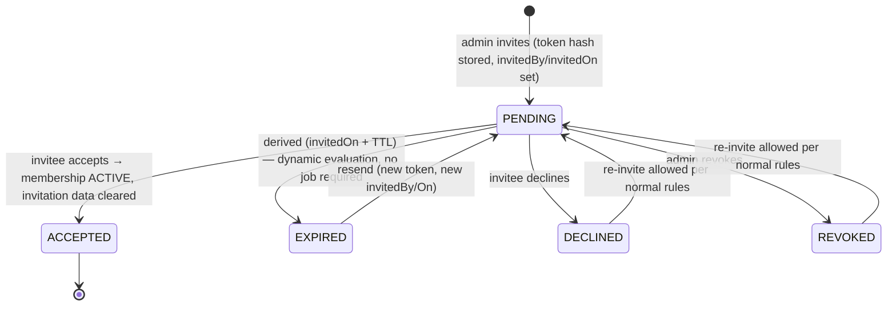
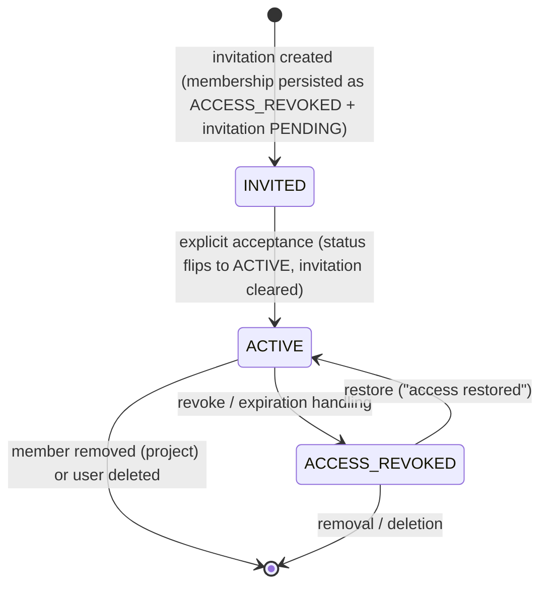

# 16 — Invitation & Membership Flows

Research-informed specification of the access lifecycle. UX evidence base:
[sequenzy invitation guide](https://www.sequenzy.com/blog/how-to-create-team-invitation-emails-saas),
[bentonow best practices](https://bentonow.com/posts/user-invitation-email-best-practices),
[B2B invitation UX](https://ecomdesignpro.com/b2b-account-invitations/).

---

## 1. Invitation state machine

Key mechanics:

- **Expiration is derived**, never stored as a separate timestamp field ([DEC]); any read path treats
  `invitedOn + TTL < now` as expired even if the stored status still says PENDING.
- **Resend replaces** the token (old link dead), updates invitedBy/invitedOn, resets to PENDING, sends a fresh email
  (BR-035). Matches research: "build a resend flow that generates a new token rather than extending the old one."
- **Accepted invitations clear** the embedded invitation object; membership becomes ACTIVE.

## 2. Membership state machine

Rules:

- **Pre-acceptance persistence (DEC-018):** an invited membership is stored with `status = ACCESS_REVOKED` and the
  embedded invitation PENDING. Access checks test `status === ACTIVE` only — no secondary invitation-status condition.
  Acceptance is the only path to ACTIVE.
- Expiration with pending invitation ⇒ membership stays ACCESS_REVOKED + invitation EXPIRED and cleared; user sees
  _"Your access to \<Tenant\> has expired."_
- Acceptance channel: opaque `/invite/:token` public landing (single-use hashed token) routing to login/register and
  resuming acceptance — the primary channel per DEC-027; the in-app "my invitations" list remains a fallback.
- Revocation without pending invitation ⇒ only membership status changes.
- **Pending invitations can never be force-activated** by an administrator (BR-036) — acceptance is always the invitee's
  explicit act.
- Restoration message: _"Your access to \<Tenant\> has been restored."_

## 3. Invitation email content contract

Per research consensus, each email contains: inviter display name, target Tenant/Project name, assigned role, expiry
timeframe, single prominent Accept button (link with opaque token), and an ignore/report line for unexpected mail. No
sensitive tenant data before authentication. Delivery via Resend (console fallback without API key).

## 4. Acceptance flow (edge cases first-class)

| Case                                    | Behavior                                                                        |
| --------------------------------------- | ------------------------------------------------------------------------------- |
| Valid token, logged out, no account     | Register pre-filled with invited email → resume acceptance                      |
| Valid token, logged out, account exists | Login (email must match invited identity) → resume                              |
| Logged in as different account          | Prompt to authenticate with invited identity — never silently attach access     |
| Token invalid/unknown                   | Neutral "invalid link" message (no existence leak)                              |
| Expired                                 | "This invitation has expired. Ask an administrator to send a new one."          |
| Revoked                                 | "This invitation is no longer valid."                                           |
| Declined                                | "The invitation was declined."                                                  |
| Already accepted                        | "This invitation has already been accepted" + sign-in link                      |
| Double-click / race                     | Idempotent acceptance: second request sees accepted state and no-ops gracefully |

Never show "email already registered" as a dead end on the acceptance path (top documented invitation-flow failure).

## 5. Admin-side management UI

Members page shows active members (name/email/role/access status) and pending invitations (email, role, invitedBy,
invitedOn, derived expiry). Actions: resend, revoke, decline-info, role change (pre-acceptance role edit allowed),
remove. Inviter notification when invitations expire unaccepted is a SHOULD-have (closes the loop;
research-recommended).

## 6. Project removal & re-addition

- Removing a Project member deletes/ends only the Project Membership; Tenant membership untouched;
  Tasks/Comments/history untouched (BR-038).
- Re-adding attaches a fresh Project Membership; historical records were never detached, so they simply belong to the
  member again; granted role determines edit capability.
- Tenant-level removal follows the same revocation semantics at Tenant scope.

## 7. Security properties

- Tokens: cryptographically random, single-use, stored **hashed**; TTL constant (recommendation: 7 days — industry
  default per research).
- Acceptance endpoints rate-limited; enumeration-resistant responses.
- All invitation/membership mutations audit-logged with actor snapshots.
