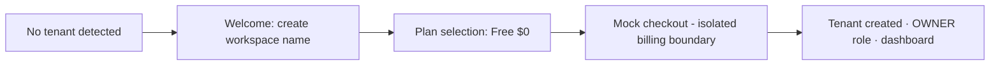

# 17 — Onboarding & Authentication

---

## 1. Registration

- Fields: email, password, confirm password, display name.
- Email normalized to lowercase before persistence & uniqueness checks ([REQ §4.1]).
- Validation client- and server-side; server authoritative.
- Creating a User does NOT create a Tenant ([UF §2.2]).
- Email verification: optional feature flag; when enabled, verification gate sits between registration and onboarding.
  MVP recommendation: enable simple verification if email sending is reliable; otherwise defer flag-off (recorded in
  [25-open-questions.md](25-open-questions.md)).

## 2. Login & session

- JWT HS256 via `hono/jwt` (repo standard). Session failure handling: clear local auth state, preserve safe return URL,
  redirect once — no infinite retry loops ([UF §2.4]).
- Post-login routing: no Tenant → onboarding; one accessible Tenant → it; multiple → selector/last-selected ([UF §2.3]).

## 3. Password reset

- Request-by-email with neutral uniform response (anti-enumeration).
- Single-use expiring reset token (hash-stored), same mechanics as invitation tokens.
- On success: invalidate existing sessions for that user (recommended), route to login.

## 4. Logout

Ends session; clears client auth state; private data unreachable from stale UI ([UF §2.5]).

## 5. First-Tenant onboarding

- Only required input: workspace name (time-to-value principle).
- Mock checkout collects no real financial data; its boundary must be replaceable by real billing without touching
  domain logic ([UF §3.1], [02-market-research.md](02-market-research.md) §2 seat-pricing convention).
- Result: user is immediately active; no auto-created Projects.

## 6. Returning users & multiple Tenants

- Tenant switcher keeps session; switching loads target Tenant's projects and clears incompatible Project context ([UF
  §7]).
- Last-selected Tenant persisted as user preference.

## 7. Session expiration UX

- Proactive: silent refresh where feasible; reactive: on 401 from protected API → the standard session-failure flow.
- Unsaved-edit protection: before discarding editor state on redirect, warn when dirty fields exist (recommended
  affordance).

## 8. Account lifecycle edge cases

| Case                                              | Behavior                                                                                                       |
| ------------------------------------------------- | -------------------------------------------------------------------------------------------------------------- |
| Deleted user attempts login                       | Neutral invalid-credentials response (no existence leak)                                                       |
| User with revoked access logs in                  | Reaches app shell but sees expired-access messaging; no Tenant data loaded                                     |
| Invitation pending + user registers independently | On login, pending invitations for their email are surfaced (banner/deep-link) so acceptance stays discoverable |

## 9. Security notes

Password hashing bcryptjs (repo standard); generic error copy; rate limiting on auth endpoints
([21-security-and-abuse-considerations.md](21-security-and-abuse-considerations.md)).
